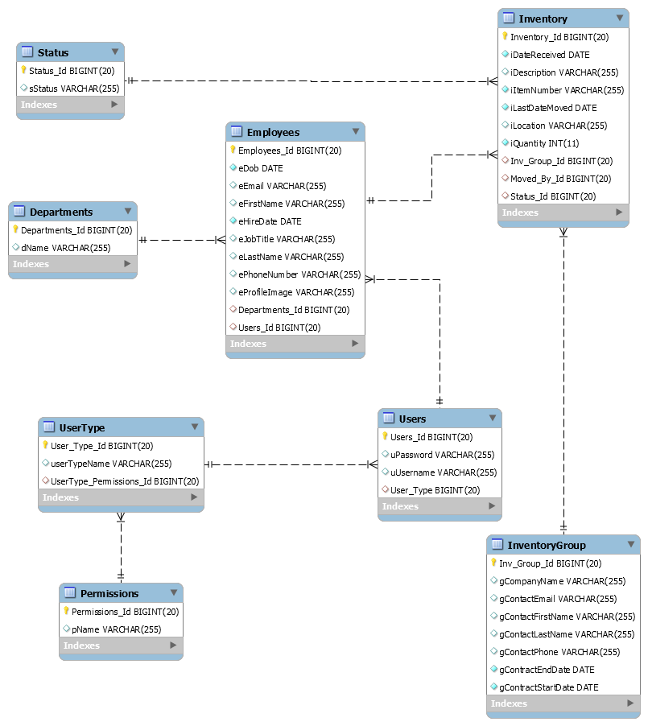

# Warehouse Inventory Case Study
Warehouse Inventory Manager for Per Scholas Case Study

### Description
I created a warhouse Inventory manager I named that has the ability to
 - view / edit / delete / add Inventory
 - view / edit / delete / add Employees
 - view / edit / delete / add Users
 - view / edit / delete / add Inventory Groups (customers who store with the warehouse)
 - login / logout
 - currently has 3 levels of security, a base user, a authorized user, and an admin
 - view status of inventory. ex. shipped, received, in location

### Features to Add
 - User Profiles
 - User Image upload
 - ability to edit / add / delete status
 - ability to edit / add / delete user types
 - permissions table available and ready for future growth.

### Trello Board Link
https://trello.com/b/tjFtolAj/in-out-asset-management

### ER Diagram

